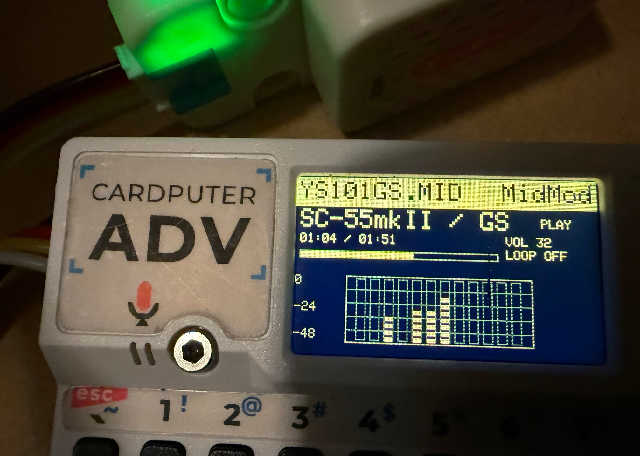

# MidMod

**MidMod = Modifiable MIDI Module**



MIDIをただ再生するだけでなく、**入力MIDIを音源に合わせて変換・補正して出力する**ための小さなMIDIモジュールです。
現在のリファレンス実装は **M5Stack Cardputer + Unit Synth (SAM2695)** です。

MidModの中心は画面ではなく、再利用可能な **MidiEngine API** です。Cardputerのファイラー／再生画面はサンプル実装です。

---

## 日本語

### 配布

Share code:

```text
vIuaTI80mgnVrSKo
```

### 必要なもの

- M5Stack Cardputer / Cardputer ADV
- [M5Stack Unit Synth (SAM2695)](https://www.switch-science.com/products/9510?srsltid=AfmBOooNvMpbnXH3pPNGaxYxoBRiLxULN7UwLYb6aW2pneM4LvDb8W00)
- microSDカード
- PlatformIO

### 主な機能

- SMF (`.mid`) 再生
- GS → SAM2695 セマンティック変換
- SC-55mkII / SC-88Pro CSVプロファイル
- CSVによる音色／ドラムmappingの追加・編集
- GS SysEx、CC、RPN/NRPNの一部変換
- Master Volume制御
- UTF-8日本語ファイル名／フォルダ名表示
- アンバーLCD風ファイラー／再生画面
- MIDIノート由来スペアナ
- 汎用 `MidiEngine` API
- UI向け `MidiPlaybackApi`

### ビルド

既定COM5:

```bat
BUILD_FLASH_MONITOR_COM5.bat
```

別ポート:

```bat
BUILD_FLASH_MONITOR_COM5.bat COM6
```

ビルドのみ:

```bat
BUILD.bat
```

Cardputerの8MB Flash向けに6MB application partitionを使用します。

### SAM2695 UART / GPIO

Cardputerサンプルの既定値は:

```text
RX = GPIO1
TX = GPIO2
Baud = 31250
```

GPIO指定は**サンプル／backend側**に置いてあります。MidiEngine coreはUARTやGPIOを知りません。

```cpp
midmodSampleInitSynthUart(MIDMOD_SYNTH_RX_PIN, MIDMOD_SYNTH_TX_PIN);
```

別機種では `platformio.ini` で変更できます。

```ini
-DMIDMOD_SYNTH_RX_PIN=13
-DMIDMOD_SYNTH_TX_PIN=14
```

詳細: `docs/SAM2695_UART.md`

### SDカード

ルート例:

```text
/sc55mk2.csv
/sc88pro.csv
/SC88PRO_TONE_TEST.mid
/日本語の曲名.mid
```

SDが `E:` の場合:

```bat
INSTALL_SD_FILES.bat E:
```

起動時は `sc55mk2.csv` を優先します。ファイラーで `P` を押すと有効なCSVプロファイルを切り替えられます。

### 操作

`M` で操作ガイドを表示します。

**ファイラー**

- `;` / `.` : 上下
- `,` / `/` : ページ移動
- Enter / Space : 開く・再生
- Backspace : 戻る
- `A` : フォルダ全再生
- `P` : CSVプロファイル切替
- `-` / `=` : 音量
- `L` : Loop

**再生中**

- Enter / Space : Pause / Resume
- `,` : 曲頭
- `/` : 次曲
- Backspace : ファイラーへ戻る
- `Q` : 停止
- `-` / `=` : 音量
- `L` : Loop

### CSVプロファイル

1音源につき1 CSVです。

```text
sc55mk2.csv
sc88pro.csv
my_module.csv
```

最小形:

```csv
# My GS Profile
# GS2SAM_PROFILE,1
meta,name,My Profile
meta,source,My MIDI Source
meta,target,SAM2695
config,rhythm_volume_percent,88
```

音色mapping例:

```csv
tone,8,*,5,127,4,,,,,,,,,Detuned EP 1 -> SAM Detuned EP1
```

ドラム例:

```csv
drumkit,25,17,0,ELECTRONIC -> POWER
drumnote,25,38,40,Electronic Snare -> SAM Snare
```

Program番号は人間向けの **1..128**、Bank/NoteはMIDI値 **0..127** です。

詳しい作り方: `docs/CSV_PROFILES.md`

### API

一番小さい入口はこれです。

```c
midi_engine_feed_byte(&engine, midi_byte);
```

MidMod coreはMIDIの送信先を固定しません。backendを差し替えればUART、USB MIDI、BLE MIDI、queue、エミュレータ内部接続などに使えます。

```c
static void myWrite(void *user, const uint8_t *bytes, size_t len)
{
    /* UART / USB MIDI / queue ... */
}

midi_engine_backend_t backend = {
    .write = myWrite,
    .set_master_volume = mySetVolume,
    .user = myContext,
};

midi_engine_t engine;
midi_engine_init(&engine, &backend, 32);
```

processorを付けなければpass-throughです。SAM2695向けGS変換が必要な場合だけ `Gs2SamProcessor` を追加します。

```c
gs2sam_processor_t gs;
gs2sam_processor_init_sc55mk2(&gs, &engine, 88);

midi_processor_t p = gs2sam_processor_interface(&gs);
midi_engine_set_processor(&engine, &p);
```

構成はシンプルです。

```text
MIDI source / emulator
        |
        v
    MidiEngine
        |
        +-- pass-through
        +-- Gs2SamProcessor
        +-- future processor
        |
        v
      backend
        |
        +-- UART / USB MIDI / BLE MIDI / ...

UI (optional) -> MidiPlaybackApi
```

PX68などのエミュレータでは、仮想MIDI UART出力から `midi_engine_feed_byte()` を呼ぶだけで接続できます。

- `docs/API.md` — 最短のAPI説明
- `docs/CSV_PROFILES.md` — CSVプロファイル
- `docs/SAM2695_UART.md` — UART/GPIO
- `docs/MIDI_ENGINE_API.md` — MidiEngine詳細
- `docs/MIDI_PLAYBACK_API.md` — UI向け再生状態API
- `examples/px68_midi_engine_bridge.c` — PX68接続例
- `examples/sam2695_uart_backend.cpp` — UART backend例

### ライセンス

GPL-3.0。`LICENSE.txt` を参照してください。

MidModはLayer812の `smfPC` を出発点として拡張したプロジェクトです。外部ライブラリはそれぞれのライセンスに従います。

---

# English

## MidMod — Modifiable MIDI Module

MidMod is a small MIDI module that can **modify and retarget incoming MIDI for a target sound module** instead of simply playing MIDI unchanged.

The current reference implementation runs on **M5Stack Cardputer + Unit Synth (SAM2695)**. The reusable core is `MidiEngine`; the Cardputer browser/player is only a sample front end.

### Distribution

Share code:

```text
vIuaTI80mgnVrSKo
```

### Hardware

- M5Stack Cardputer / Cardputer ADV
- [M5Stack Unit Synth (SAM2695)](https://www.switch-science.com/products/9510?srsltid=AfmBOooNvMpbnXH3pPNGaxYxoBRiLxULN7UwLYb6aW2pneM4LvDb8W00)
- microSD card
- PlatformIO

### Features

- SMF playback
- GS → SAM2695 retargeting
- Editable SC-55mkII / SC-88Pro CSV profiles
- Selected GS SysEx, CC, RPN/NRPN and drum translations
- UTF-8 Japanese filenames/folders
- Amber browser/player sample UI
- MIDI-note spectrum display
- Generic `MidiEngine`
- Optional `MidiPlaybackApi`

### Build

```bat
BUILD_FLASH_MONITOR_COM5.bat
```

Pass another COM port as the first argument if needed.

### UART / GPIO

The Cardputer sample defaults to:

```text
RX = GPIO1
TX = GPIO2
Baud = 31250
```

Pin selection belongs to the host/backend, not MidiEngine.

```cpp
midmodSampleInitSynthUart(MIDMOD_SYNTH_RX_PIN, MIDMOD_SYNTH_TX_PIN);
```

Override pins in `platformio.ini`:

```ini
-DMIDMOD_SYNTH_RX_PIN=13
-DMIDMOD_SYNTH_TX_PIN=14
```

See `docs/SAM2695_UART.md`.

### CSV profiles

Profiles live in the SD-card root. A profile starts with:

```csv
# My GS Profile
# GS2SAM_PROFILE,1
meta,name,My Profile
meta,source,My MIDI Source
meta,target,SAM2695
```

Press `P` in the browser to cycle valid profiles.

See `docs/CSV_PROFILES.md` for tone, drum and config formats.

### API quick start

The smallest integration point is:

```c
midi_engine_feed_byte(&engine, midi_byte);
```

`MidiEngine` is transport-neutral. Its backend may write to UART, USB MIDI, BLE MIDI, a queue, or an emulator-internal target.

Without a processor it is pass-through. Install `Gs2SamProcessor` only when GS → SAM2695 conversion is required.

```text
MIDI source / emulator
        |
        v
    MidiEngine
        |
        +-- pass-through
        +-- Gs2SamProcessor
        +-- future processor
        |
        v
      backend
```

See:

- `docs/API.md`
- `docs/CSV_PROFILES.md`
- `docs/SAM2695_UART.md`
- `examples/`

### License

GPL-3.0. See `LICENSE.txt`.
Third-party libraries retain their own licenses.
